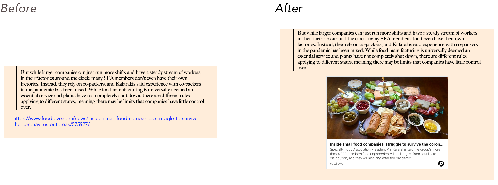
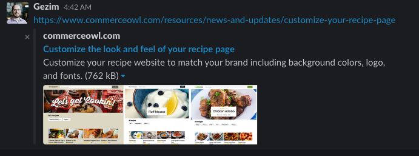

# Show Link Previews In Your Markdown with Gatsby Remark Link Unfurl

Transform your boring old blue-underlined links in your Gatsby blog:



## Motivation

I've always admired how good links look in Slack. Instead of showing you a measly underlined blue link, Slack show you this:



I wanted to achieve the same for my blog running GatsbyJS. So, I searched high and low and the closest I came was [Gatsby Remark Oembed Plugin](https://github.com/raae/gatsby-remark-oembed).

It had a number of undesirable behaviors:

- Gatsby Remark Oembed Plugin does requests to links each time you build your site. This could really add up and is unnecessary, IMO. Gatsby Remark Link Unfurl solves this by caching previous curies in a file.
- It actually embeds iFrames for some websites (e.g. YouTube) and for others it loads external JS code. I didn't want third party code added to my blog. Gatsby Remark Link Unfurl only links to external sites (no embedding happens) and no third-party JavaScript is loaded onto your site.
- It doesn't support non-popular sites that don't have [oEmbed](https://oembed.com/) implemented. Gatsby Remark Link Unfurl doesn't rely on oEmbed. Instead we implement a [similar solution to Slack](https://medium.com/slack-developer-blog/everything-you-ever-wanted-to-know-about-unfurling-but-were-afraid-to-ask-or-how-to-make-your-e64b4bb9254) by getting Twitter card, open graph data and meta tag data.

Side note: I just discovered that unfurl is not a made up word:


## Usage

### Install Gatsby Remark Link Unfurl

1. `npm install --save gatsby-remark-link-unfurl`

    Note: This requires either `gatsby-plugin-mdx` or `gatsby-transformer-remark`.

#### With Gatsby Plugin MDX

Add `gatsby-remark-link-unfurl` to `gatsbyRemarkPlugins` in `gatsby-config.js`:

**Important**: `processedUrlsFile` is the JSON file that will store previously processed urls. This file will be created if it doesn't exist. If it exists, it should be a valid JSON file. You should commit this to your repository.

```js
// In your gatsby-config.js
plugins: [
{
      resolve: `gatsby-plugin-mdx`,
      options: {
        extensions: [`.mdx`, `.md`],
        gatsbyRemarkPlugins: [
          {
            resolve: `gatsby-remark-link-unfurl`,
            options: {
              processedUrlsFile: `${__dirname}/link-cache/cache.json`,
            },
          },
        ]
      }
}
],
```

#### With Gatsby Transformer Remark

```js
// In your gatsby-config.js
plugins: [
  {
    resolve: `gatsby-transformer-remark`,
    options: {
      // CommonMark mode (default: true)
      commonmark: true,
      // Footnotes mode (default: true)
      footnotes: true,
      // Pedantic mode (default: true)
      pedantic: true,
      // GitHub Flavored Markdown mode (default: true)
      gfm: true,
      // Plugins configs
      plugins: [{
            resolve: `gatsby-remark-link-unfurl`,
            options: {
              processedUrlsFile: `${__dirname}/link-cache/cache.json`,
            },
          }],
    },
  },
],
```

### Your Markdown Post

We only transform links if they're on their own line:

```md
# Your awesome blog title

Your amazing thoughts. 

And finally a link:

https://www.commerceowl.com/resources/news-and-updates/customize-your-recipe-page

```

## Styling

I did not want to inline the styles and cause bloat.
You can style as you wish but the default styles are below.

These are shamelessly copied from [microlink](https://microlink.io/docs/sdk/integrations/react).

```css
a.gatsby-remark-link-unfurl__container {
    margin: 0 auto;
    font-size: 21px;
    line-height: 24px;
    font-weight: lighter;
    max-width: 500px;
    background-color: #fff;
    border-width: 1px;
    border-style: solid;
    border-color: #e1e8ed;
    overflow: hidden;
    color: #181919;
    font-family: InterUI, -apple-system, BlinkMacSystemFont, 'Helvetica Neue', 'Segoe UI', Oxygen, Ubuntu, Cantarell, 'Open Sans', sans-serif;
    display: flex;
    text-decoration: none;
    opacity: 1;
    position: relative;
    transition-duration: 150ms;
    transition-timing-function: cubic-bezier(0.25, 0.8, 0.25, 1);
    transition-property: background, border-color;
    will-change: background, border-color;
    flex-direction: column;
    height: 382px;
}

a.gatsby-remark-link-unfurl__container:hover {
    background: #f5f8fa;
    border-color: rgba(136, 153, 166, 0.5);
    outline: 0;
}

.gatsby-remark-link-unfurl__media {
    flex-shrink: 1;
    flex-grow: 1;
    flex-basis: 0%;
    background: transparent no-repeat center center / cover;
    display: block;
    overflow: hidden;
    height: auto;
}

.gatsby-remark-link-unfurl__content {
    display: flex;
    padding: 10px 15px;
    min-width: 0;
    box-sizing: border-box;
    flex: 0 0 125px;
    justify-content: space-around;
    flex-direction: column;
    align-items: stretch;
}

.gatsby-remark-link-unfurl__title {
    text-align: left;
    font-weight: bold;
    margin: 0;
    width: 100%;
    flex-grow: 1.2;
    font-size: 16px;
}

.gatsby-remark-link-unfurl__title p {
    margin: 0;
    overflow: hidden;
    white-space: nowrap;
    text-overflow: ellipsis;
}

.gatsby-remark-link-unfurl__description {
    text-align: left;
    font-size: 14px;
    flex-grow: 2;
    margin: auto 0;
    line-height: 18px;
}

.gatsby-remark-link-unfurl__description p {
    margin: 0;
}

.gatsby-remark-link-unfurl__container footer {
    display: flex;
    align-items: center;
    justify-content: space-between;
    text-align: left;
    margin: 0;
    flex-grow: 0;
    font-size: 12px;
    width: 100%;
}

.gatsby-remark-link-unfurl__container footer p {
    overflow: hidden;
    white-space: nowrap;
    text-overflow: ellipsis;
    margin-top: 0;
}

.gatsby-remark-link-unfurl__container footer span {
    min-width: 16px;
    width: 25px;
    height: 25px;
    background-size: contain;
}
```

If you're using [emotion](https://github.com/emotion-js/emotion), you can add the styles using the `<Global>` tag in your blog template like so:

```js
// In your blogTemplate.jsx which you use in gatsby-node.js
//  to generate blog posts.
import { css, Global } from '@emotion/core'

export default function Template({
    data, // this prop will be injected by the GraphQL query below.
}) {
    return (
        <Layout> {/* assuming you have a layout defined */}
            <Global
                styles={css`
              a.gatsby-remark-link-unfurl__container {
                margin: 0 auto;
                font-size: 21px;
                line-height: 24px;
                font-weight: lighter;
                max-width: 500px;
                background-color: #fff;
                border-width: 1px;
                border-style: solid;
                border-color: #e1e8ed;
                overflow: hidden;
                color: #181919;
                font-family: InterUI, -apple-system, BlinkMacSystemFont,
                  'Helvetica Neue', 'Segoe UI', Oxygen, Ubuntu, Cantarell,
                  'Open Sans', sans-serif;
                display: flex;
                text-decoration: none;
                opacity: 1;
                position: relative;
                transition-duration: 150ms;
                transition-timing-function: cubic-bezier(0.25, 0.8, 0.25, 1);
                transition-property: background, border-color;
                will-change: background, border-color;
                flex-direction: column;
                height: 382px;
                :hover {
                  background: #f5f8fa;
                  border-color: rgba(136, 153, 166, 0.5);
                  outline: 0;
                }
              }
              .gatsby-remark-link-unfurl__media {
                flex-shrink: 1;
                flex-grow: 1;
                flex-basis: 0%;
                background: transparent no-repeat center center / cover;
                display: block;
                overflow: hidden;
                height: auto;
              }
              .gatsby-remark-link-unfurl__content {
                display: flex;
                padding: 10px 15px;
                min-width: 0;
                box-sizing: border-box;
                flex: 0 0 125px;
                justify-content: space-around;
                flex-direction: column;
                align-items: stretch;
              }
              .gatsby-remark-link-unfurl__title {
                text-align: left;
                font-weight: bold;
                margin: 0;
                width: 100%;
                flex-grow: 1.2;
                font-size: 16px;
              }
              .gatsby-remark-link-unfurl__title p {
                margin: 0;
                overflow: hidden;
                white-space: nowrap;
                text-overflow: ellipsis;
              }
              .gatsby-remark-link-unfurl__description {
                /* font-weight: lighter; */
                text-align: left;
                font-size: 14px;
                flex-grow: 2;
                margin: auto 0;
                line-height: 18px;
              }
    
              .gatsby-remark-link-unfurl__description p {
                margin: 0;
              }
    
              .gatsby-remark-link-unfurl__container footer {
                display: flex;
                align-items: center;
                justify-content: space-between;
                text-align: left;
                margin: 0;
                flex-grow: 0;
                font-size: 12px;
                width: 100%;
              }
    
              .gatsby-remark-link-unfurl__container footer p {
                overflow: hidden;
                white-space: nowrap;
                text-overflow: ellipsis;
                margin-top: 0;
              }
    
              .gatsby-remark-link-unfurl__container footer span {
                min-width: 16px;
                width: 25px;
                height: 25px;
                background-size: contain;
              }
            `}
            />
            {/* Other component and blog post content */}
        </Layout>
    )
}
```

# Inspiration

- [Gatsby Remark Oembed Plugin](https://github.com/raae/gatsby-remark-oembed)
- [Microlink](https://microlink.io/docs/sdk/integrations/react)